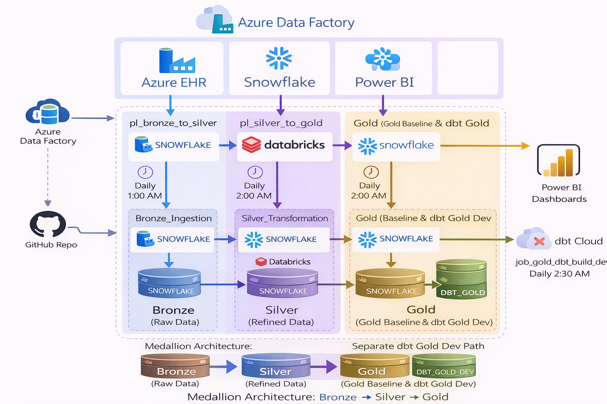
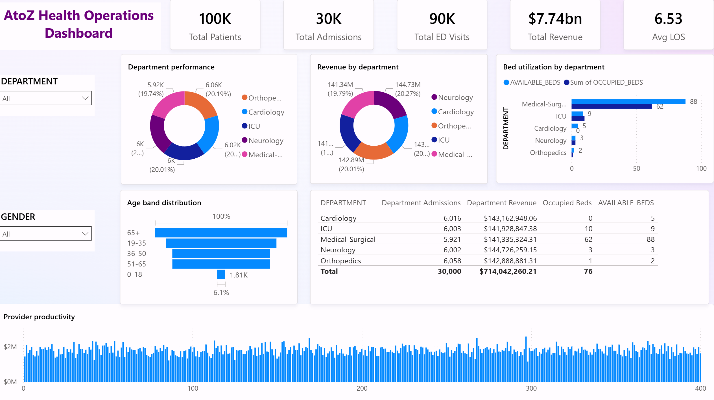

# Healthcare Data Platform — Azure + Databricks + dbt + Snowflake

## Overview

This project implements an end-to-end **Healthcare Data Platform** using a modern **Medallion Architecture (Bronze → Silver → Gold)** with enterprise-grade tooling.

The platform ingests, transforms, models, and serves healthcare data across multiple layers while maintaining clear separation of responsibilities between orchestration, compute, and transformation tools.

---

## Architecture



### Technology Stack

| Layer                      | Tool                     |
| -------------------------- | ------------------------ |
| Orchestration              | Azure Data Factory (ADF) |
| Compute / ETL              | Azure Databricks         |
| Data Warehouse             | Snowflake                |
| Transformation Layer       | dbt (Cloud + Core)       |
| Version Control            | GitHub                   |
| Visualization              | Power BI                 |

---

## Medallion Architecture

### Bronze Layer

* Raw ingestion from source systems
* Minimal transformation
* Stored in Snowflake (BRONZE schema)

---

### Silver Layer

* Cleaned, validated, and structured data
* Table-specific transformations (not generic)
* Implemented using **Databricks notebooks**
* Orchestrated via **ADF pipeline**

**Key Tables**

* PATIENT_MASTER_SILVER
* INPATIENT_ADMISSIONS_SILVER
* EMERGENCY_VISITS_SILVER
* LAB_ORDERS_RESULTS_SILVER
* PHARMACY_ORDERS_SILVER
* RADIOLOGY_ORDERS_SILVER
* REHAB_PHYSIO_VISITS_SILVER
* PROVIDERS_SILVER
* DEPARTMENTS_SILVER
* BED_INVENTORY_SILVER
* OUTPATIENT_APPOINTMENTS_SILVER

---

### Gold Layer (Dual Implementation)

#### 1. Databricks Gold (Production Baseline)

* Implemented using Databricks SQL transformations
* Orchestrated via ADF
* Stored in Snowflake `GOLD` schema
* Serves as **stable production baseline**

#### 2. dbt Gold (Modern Transformation Layer)

* Implemented using dbt models
* Built in Snowflake `DBT_GOLD_DEV` schema
* Represents **next-generation transformation layer**

---

## dbt Implementation

### Project Setup

* dbt Core (local) + dbt Cloud (deployment)
* Connected to Snowflake
* GitHub-integrated project

### Models Created

* patient_summary
* department_summary
* provider_summary
* bed_utilization_summary
* lab_summary
* pharmacy_summary
* radiology_summary
* rehab_summary
* hospital_kpi_summary
* patient_care_journey_summary
* department_operational_kpi_summary

---

### Example Model (patient_summary)

```sql
select
    p.patient_id,
    p.first_name,
    p.last_name,
    count(distinct a.admission_id) as total_admissions,
    sum(a.total_charge) as total_inpatient_cost
from atozhealth_db.silver.patient_master_silver p
left join atozhealth_db.silver.inpatient_admissions_silver a
    on p.patient_id = a.patient_id
group by p.patient_id, p.first_name, p.last_name
```

---

### dbt Testing

* Built-in tests implemented:

  * `not_null`
  * `unique`
* All tests passing successfully

---

### dbt Documentation & Lineage


* Automatic lineage graph generated
* Clear model dependencies
* Supports onboarding and governance

---

## Orchestration Design

### ADF Pipelines

#### 1. Bronze → Silver

* Pipeline: `pl_bronze_to_silver`
* Trigger: Daily at 1:00 AM

#### 2. Silver → Gold (Databricks)

* Pipeline: `pl_silver_to_gold`
* Trigger: Daily at 2:00 AM

---

### dbt Scheduling

* dbt Cloud job: `job_gold_dbt_build_dev`
* Runs independently at **2:30 AM**
* Builds Gold models in `DBT_GOLD_DEV`

---

## Architecture Decision (Important)

This project intentionally uses a **hybrid orchestration model**:

* ADF handles ingestion and Silver transformations
* dbt Cloud independently handles Gold transformations

### Why?

* Avoids unnecessary complexity of API orchestration
* Preserves stable Databricks pipeline
* Enables gradual migration to dbt
* Reflects real-world enterprise adoption patterns

---

## Data Quality & Monitoring

* ADF pipeline alerts configured
* Log Analytics integration enabled
* dbt tests ensure data integrity
* Manual validation performed across layers

---

## Key Learnings

* dbt does not execute transformations itself — Snowflake does
* Table-specific transformations outperform generic pipelines
* Separation of orchestration and transformation improves stability
* Hybrid architectures are often more practical than full migrations

---

## Future Enhancements

* Power BI dashboards on Gold layer
* Replace Databricks Gold with dbt (optional)
* CI/CD for dbt deployments
* Advanced dbt tests and source freshness checks
* Centralized orchestration (ADF → dbt integration)

---

## Repository Structure

```
healthcare-data-platform-azure-databricks-dbt-snowflake/
│
├── adf/
├── databricks/
├── dbt/
│   └── atozhealth_dbt/
├── sql/
├── powerbi/
├── assets/
└── docs/
```

---

---

## Data Warehouse (Snowflake)


## Dashboard Preview




## Author
Amanuel Birri