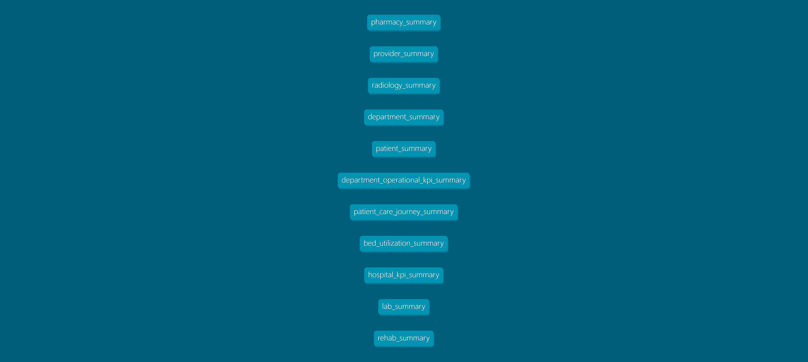
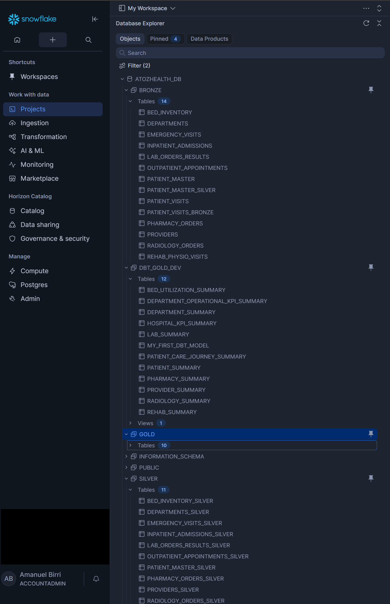

# Healthcare Data Platform (Azure + Databricks + Snowflake + dbt)

## Overview
End-to-end enterprise-grade healthcare data platform built using Medallion Architecture (Bronze → Silver → Gold), integrating orchestration, transformation, warehousing, and modern data modeling.

## Architecture
- **ADF** → orchestration & scheduling  
- **Databricks** → Bronze & Silver transformations  
- **Snowflake** → data warehouse  
- **dbt** → Gold modeling layer  
- **Azure Monitor** → alerting & logging  

## Key Features
- Automated pipelines with failure alerting
- Clean medallion architecture
- Modular dbt models for analytics layer
- Data quality testing using dbt
- Environment separation (DEV vs PROD)
- Scalable enterprise design

## Data Layers

### Bronze
Raw ingestion layer

### Silver
Cleaned and standardized datasets

### Gold
Business-level aggregated models:
- patient_summary
- department_summary
- provider_summary
- hospital_kpi_summary
- patient_care_journey_summary
- and more...

## dbt Capabilities Implemented
- Modular models
- Testing (not_null, unique)
- Documentation & lineage
- Environment configuration

## How to Run (High-Level)
1. ADF triggers pipelines
2. Databricks processes Bronze → Silver
3. dbt builds Gold layer in Snowflake

## Project Status
Production-ready architecture with monitoring and alerting enabled.

## Data Lineage (dbt)

## Orchestration (ADF)

## Data Warehouse (Snowflake)

## Author
Amanuel Kebede